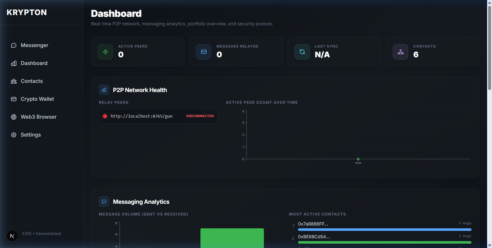
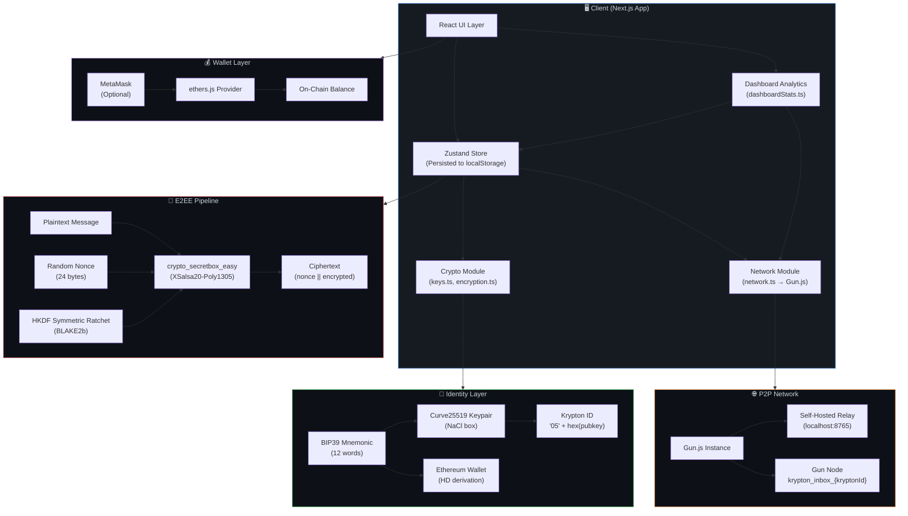
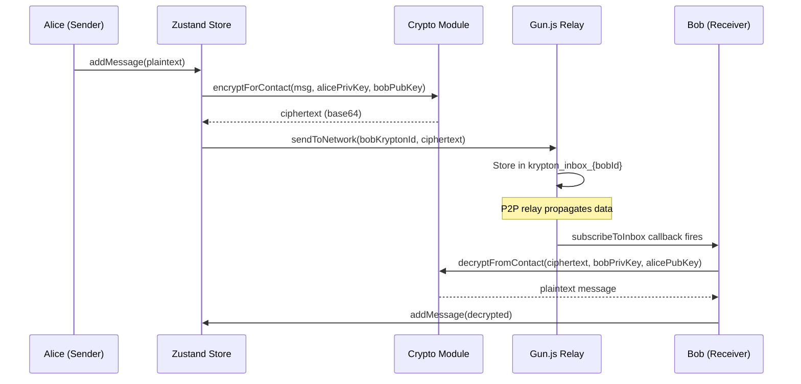
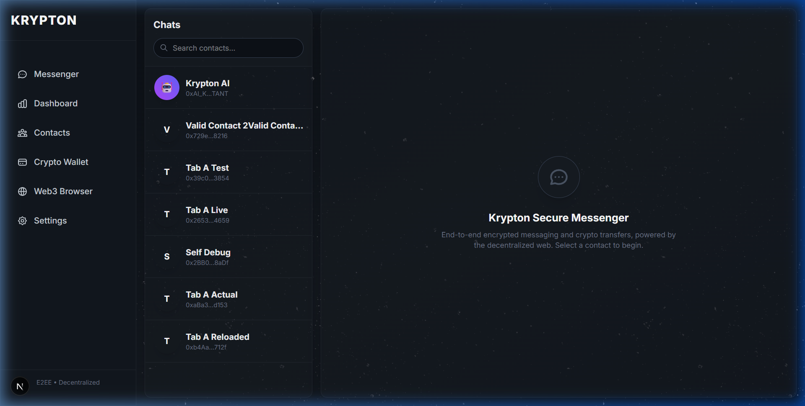
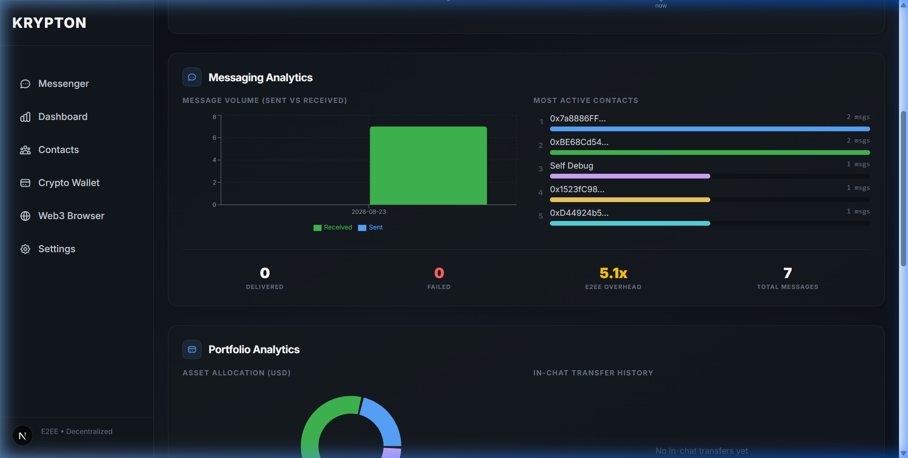
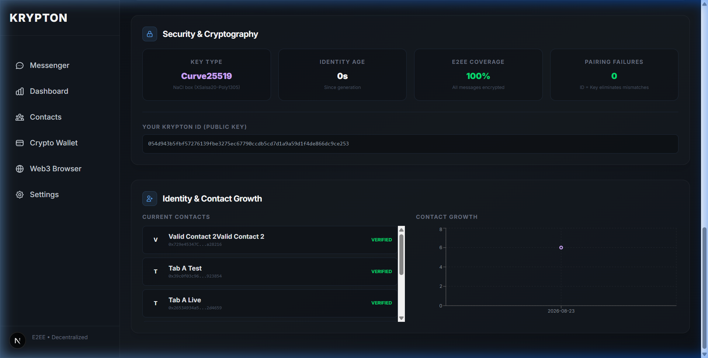
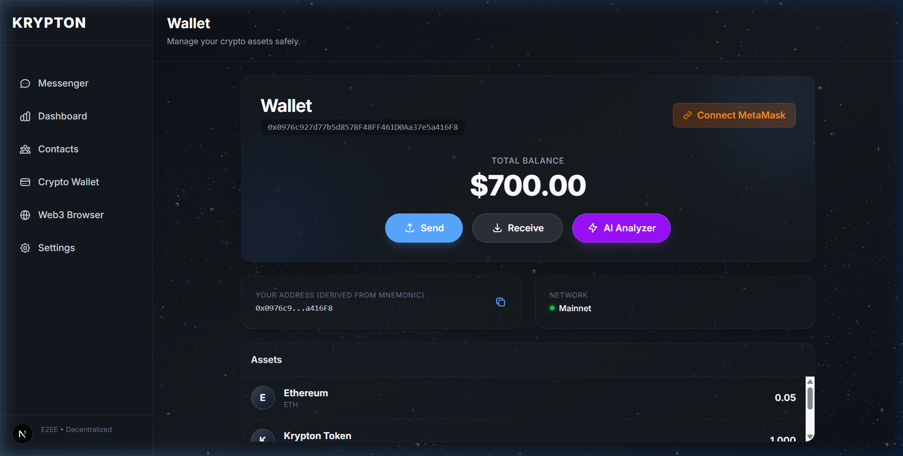
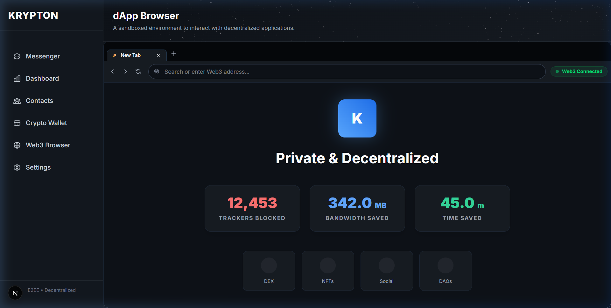
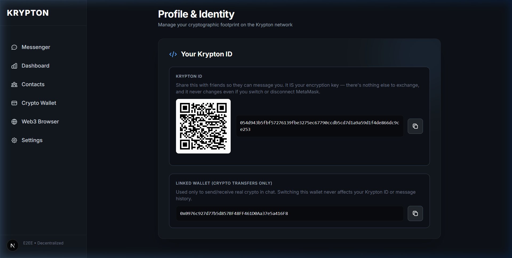
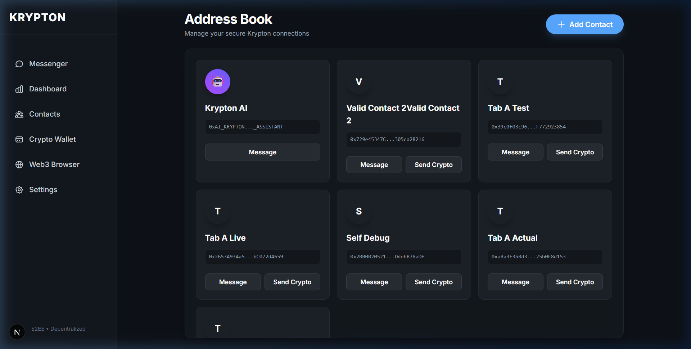

<p align="center">
  
</p>

<h1 align="center">🔐 KRYPTON</h1>

<p align="center">
  <strong>A Decentralized, End-to-End Encrypted Messenger & Crypto Wallet</strong>
</p>

<p align="center">
  <em>Built with Next.js • Curve25519 Cryptography • Gun.js P2P Network • Ethers.js</em>
</p>

<p align="center">
  
  
  
  
  
  
</p>

---

## 📋 Table of Contents

- [Overview](#-overview)
- [Key Features](#-key-features)
- [System Architecture](#-system-architecture)
- [Screenshots](#-screenshots)
- [Technology Stack](#-technology-stack)
- [Project Structure](#-project-structure)
- [Getting Started](#-getting-started)
- [How It Works](#-how-it-works)
  - [Identity & Key Generation](#1-identity--key-generation)
  - [End-to-End Encryption](#2-end-to-end-encryption)
  - [P2P Messaging via Gun.js](#3-p2p-messaging-via-gunjs)
  - [Crypto Wallet Integration](#4-crypto-wallet-integration)
- [Module Deep Dives](#-module-deep-dives)
  - [Encrypted Messenger](#-encrypted-messenger)
  - [Analytics Dashboard](#-analytics-dashboard)
  - [Crypto Wallet](#-crypto-wallet)
  - [Web3 Browser](#-web3-browser)
  - [Contact Management](#-contact-management)
  - [Settings & Identity](#-settings--identity)
- [Security Model](#-security-model)
- [Self-Hosted Gun Relay](#-self-hosted-gun-relay)
- [Environment Variables](#-environment-variables)
- [Contributing](#-contributing)
- [License](#-license)

---

## 🌐 Overview

**Krypton** is a fully decentralized, end-to-end encrypted messaging platform combined with a cryptocurrency wallet and a Web3 browser. It is designed as a research-grade demonstration of how modern cryptographic primitives (Curve25519, XSalsa20-Poly1305) can be combined with decentralized peer-to-peer networking (Gun.js) to create a communication system where:

- **No central server** ever sees your messages in plaintext.
- **Your identity IS your public key** — eliminating the entire class of key-pairing bugs that plague traditional E2EE messengers.
- **Crypto transfers happen inside the chat** — like ADAMANT Messenger, but with onion-style routing metadata stripping.

Krypton draws design inspiration from:

| Project | What Krypton Borrows |
|---------|---------------------|
| **Session** | Krypton ID format (`05` + hex pubkey), no phone/email required |
| **ADAMANT** | BIP39 mnemonic-based identity, in-chat crypto transfers |
| **Signal** | Curve25519 key exchange, E2EE by default |
| **Brave Browser** | Shields UP, tracker blocking, privacy-first Web3 browsing |
| **Status** | Ethereum wallet integration, decentralized chat |

---

## ✨ Key Features

### 🔒 End-to-End Encrypted Messaging
- Every message is encrypted using **Curve25519 + XSalsa20-Poly1305** (via libsodium)
- **Perfect Forward Secrecy (PFS):** Uses an HKDF-style symmetric key ratchet (BLAKE2b) to rotate keys per message.
- **Self-Destruct & Unsend:** Supports disappearing messages with customizable TTLs and real-time message unsending (tombstoning).
- **Offline Queue:** Safely spools messages when the network relay drops and auto-flushes upon reconnection.
- Zero-knowledge architecture — the relay never sees plaintext
- Krypton ID = Public Key — no separate key exchange step required

### 📊 Real-Time Analytics Dashboard
- **P2P Network Health** — live relay status, peer count over time
- **Messaging Analytics** — volume charts, delivery stats, encryption overhead
- **Portfolio Analytics** — asset allocation donut chart, transfer history
- **Security Stats** — key type, E2EE coverage, pairing failure count
- **Contact Growth** — identity timeline with verified contact list

### 💰 Integrated Crypto Wallet
- BIP39 mnemonic-derived Ethereum wallet
- MetaMask integration for real on-chain balances
- **Real On-Chain Transfers:** Supports broadcasting real Ethers.js transactions on the Sepolia Testnet directly within the chat UI.
- In-chat crypto transfers (ADAMANT-style)
- QR code receive address

### 🌐 Brave-Style Web3 Browser
- Multiple tab support with tab management
- "Shields UP" privacy protection with tracker blocking stats
- Secure address bar with HTTPS padlock indicator
- Beautiful privacy-focused start page
- Support for `krypton://` internal protocol

### 👥 Decentralized Contact Management
- Add contacts by scanning QR codes or pasting Krypton IDs
- Auto-discovery of contacts from incoming messages
- Every contact is cryptographically verified by default

### ⚙️ Identity & Settings
- BIP39 mnemonic generation and backup
- QR code for easy Krypton ID sharing
- Full key information display

---

## 🏗 System Architecture

The following diagram shows how all the components of Krypton interact:



### Data Flow: Sending a Message



### Key Architecture Decisions

| Decision | Rationale |
|----------|-----------|
| **Krypton ID = Public Key** | Eliminates key-pairing bugs entirely. The identity string itself IS the encryption key — no separate "public key" field to go stale or get mismatched. |
| **Gun.js for P2P** | Decentralized, no central server dependency. Supports store-and-forward with self-hosted relays. |
| **Zustand + localStorage** | Lightweight state management with automatic persistence. Custom serialization handles `Uint8Array` round-tripping. |
| **Separate chat identity from wallet** | MetaMask connecting/switching only updates the linked wallet. Chat identity (Krypton ID) never changes, preventing resubscription bugs. |
| **Self-hosted relay** | Public Gun relays are unreliable. A dedicated relay ensures message delivery and provides a viva-ready talking point about network infrastructure. |

---

## 📸 Screenshots

### Encrypted Messenger
Real-time E2E encrypted chat with onion routing metadata, encryption hash display, and in-chat crypto transfer support.



---

### Analytics Dashboard — Network Health
Live P2P relay status indicators, active peer count over time, and top-level stat cards.


---

### Analytics Dashboard — Messaging & Portfolio
Message volume charts (sent vs received), most active contacts, delivery stats, asset allocation donut chart, and in-chat transfer history.



---

### Analytics Dashboard — Security & Contacts
Cryptographic key information, E2EE coverage invariant, pairing failure count, contact list with verification status, and contact growth chart.



---

### Crypto Wallet
BIP39-derived Ethereum wallet with MetaMask integration, send/receive modals, QR code, and AI portfolio analyzer.



---

### Web3 Browser
Brave-style decentralized browser with multiple tabs, Shields UP privacy protection, tracker blocking stats, and a beautiful start page.



---

### Settings & Identity
Krypton ID display with QR code for sharing, BIP39 mnemonic backup, and key information.



---

### Contact Management
Add contacts by QR code or Krypton ID paste. All contacts are cryptographically verified by default since ID = Key.



---

## 🛠 Technology Stack

| Layer | Technology | Purpose |
|-------|-----------|---------|
| **Frontend Framework** | Next.js 16.3 (App Router) | Server/client rendering, routing, API routes |
| **Language** | TypeScript 5.x | Type safety across the entire codebase |
| **State Management** | Zustand 5.x | Lightweight store with `persist` middleware for localStorage |
| **Styling** | Tailwind CSS 4.x | Utility-first CSS with glassmorphism design system |
| **Encryption** | libsodium-wrappers + tweetnacl | Curve25519 key exchange, XSalsa20-Poly1305 authenticated encryption |
| **P2P Networking** | Gun.js | Decentralized data sync, store-and-forward relay |
| **Blockchain** | Ethers.js 6.x | Ethereum wallet derivation, MetaMask provider, on-chain balance |
| **Key Derivation** | @scure/bip39 + @scure/bip32 | BIP39 mnemonic generation, deterministic key derivation |
| **Charts** | Recharts | AreaChart, BarChart, PieChart for the analytics dashboard |
| **QR Codes** | qrcode.react | QR code generation for Krypton ID and wallet address sharing |
| **Validation** | Zod 4.x | Runtime schema validation for wallet assets and addresses |

---

## 📁 Project Structure

```
krypton-app/
├── public/                          # Static assets
├── docs/
│   └── screenshots/                 # App screenshots for README
├── relay.js                         # Self-hosted Gun.js relay server
├── src/
│   ├── app/                         # Next.js App Router pages
│   │   ├── layout.tsx               # Root layout with Sidebar
│   │   ├── page.tsx                 # Home page (redirects to /chat)
│   │   ├── globals.css              # Global styles & design tokens
│   │   ├── api/
│   │   │   └── ai/
│   │   │       └── route.ts         # AI assistant API route (OpenRouter)
│   │   ├── chat/
│   │   │   └── page.tsx             # Messenger page
│   │   ├── dashboard/
│   │   │   └── page.tsx             # Analytics dashboard page
│   │   ├── contacts/
│   │   │   └── page.tsx             # Contact management page
│   │   ├── wallet/
│   │   │   └── page.tsx             # Crypto wallet page
│   │   ├── browser/
│   │   │   └── page.tsx             # Web3 browser page
│   │   └── settings/
│   │       └── page.tsx             # Identity & settings page
│   │
│   ├── components/                  # React components
│   │   ├── ChatWindow.tsx           # E2E encrypted messenger UI
│   │   ├── Dashboard.tsx            # Full analytics dashboard (5 sections)
│   │   ├── Sidebar.tsx              # Navigation sidebar
│   │   ├── WalletDashboard.tsx      # Crypto wallet UI
│   │   ├── WalletProvider.tsx       # MetaMask/ethers.js provider context
│   │   └── Web3Browser.tsx          # Brave-style Web3 browser with tabs
│   │
│   ├── crypto/                      # Cryptography & networking
│   │   ├── keys.ts                  # BIP39 → Curve25519 + ETH key generation
│   │   ├── encryption.ts            # E2EE encrypt/decrypt (libsodium)
│   │   └── network.ts               # Gun.js P2P relay + peer event system
│   │
│   ├── store/                       # State management
│   │   ├── useKryptonStore.ts       # Main Zustand store (identity, messages, contacts, wallet)
│   │   └── dashboardStats.ts        # Analytics computation utilities
│   │
│   └── types/                       # TypeScript type definitions
│       └── index.ts                 # Message, Contact, Wallet types + Zod schemas
│
├── package.json
├── tsconfig.json
├── next.config.ts
└── README.md                        # ← You are here
```

---

## 🚀 Getting Started

### Prerequisites

- **Node.js** ≥ 18.x
- **npm** ≥ 9.x
- A modern browser (Chrome, Edge, Firefox, Brave)

### Installation

```bash
# 1. Clone the repository
git clone https://github.com/your-username/krypton-app.git
cd krypton-app

# 2. Install dependencies
npm install

# 3. Start the self-hosted Gun relay (in a separate terminal)
node relay.js
# Output: Gun relay running on http://localhost:8765/gun

# 4. Start the development server
npm run dev
# Output: Ready on http://localhost:3000
```

### First-Time Setup

1. **Open the app** at `http://localhost:3000`
2. **A fresh Krypton identity is auto-generated** (BIP39 mnemonic + Curve25519 keys)
3. **Go to Settings** to see your Krypton ID and QR code
4. **To test messaging between two users:**
   - Open a second browser window (or Incognito/Private mode)
   - Clear localStorage if you have old data: DevTools → Application → Local Storage → Clear
   - Each instance gets its own unique identity
   - Copy/scan each other's Krypton ID via the QR code in Settings
   - Add each other as contacts in the Contacts section
   - Start sending encrypted messages!

> **⚠️ Important:** If you have old localStorage data from a previous version, delete it first. Old identities may not have the `kryptonId` field and will break the app.

---

## ⚙️ How It Works

### 1. Identity & Key Generation

When you first open Krypton, a new identity is generated automatically:

```
BIP39 Mnemonic (12 words)
    │
    ├──→ Seed (64 bytes)
    │       │
    │       ├──→ First 32 bytes → Curve25519 Keypair (NaCl box)
    │       │       │
    │       │       ├──→ Public Key  → Krypton ID: "05" + hex(publicKey)
    │       │       └──→ Private Key → Stored in Zustand (persisted)
    │       │
    │       └──→ HD Derivation (BIP44) → Ethereum Wallet
    │               │
    │               ├──→ ETH Address (for crypto transfers)
    │               └──→ Private Key (for signing transactions)
    │
    └──→ Mnemonic is displayed in Settings for backup
```

**Key insight:** The Krypton ID (`05` + hex-encoded public key) IS the user's identity AND their encryption key. There is no separate "public key" field — this eliminates the entire class of key-pairing bugs found in traditional E2EE systems.

### 2. End-to-End Encryption

Every message goes through this encryption pipeline:

```typescript
// Encryption (sender side)
const nonce = sodium.randombytes_buf(24);           // Random 24-byte nonce
const ciphertext = sodium.crypto_box_easy(          // XSalsa20-Poly1305
    plaintext,                                       // Your message
    nonce,                                           // Unique per message
    recipientPublicKey,                              // Derived from their Krypton ID
    senderPrivateKey                                 // Your secret key
);
// Result: base64(nonce || ciphertext)

// Decryption (receiver side)
const plaintext = sodium.crypto_box_open_easy(
    ciphertext,
    nonce,
    senderPublicKey,                                 // Derived from sender's Krypton ID
    recipientPrivateKey                              // Your secret key
);
```

The encryption algorithm used is **NaCl `crypto_box`**, which provides:
- **Confidentiality** via XSalsa20 stream cipher
- **Authentication** via Poly1305 MAC
- **Key exchange** via Curve25519 ECDH

### 3. P2P Messaging via Gun.js

Messages are routed through a decentralized Gun.js peer-to-peer network:

```
Sender                    Gun.js Relay                  Receiver
  │                           │                            │
  │  sendToNetwork()          │                            │
  ├──────────────────────────→│                            │
  │  gun.get(inbox).set(msg)  │                            │
  │                           │  subscribeToInbox()        │
  │                           │←───────────────────────────┤
  │                           │  gun.get(inbox).map().on() │
  │                           │                            │
  │                           │  New data event            │
  │                           ├───────────────────────────→│
  │                           │                            │  decrypt & display
```

Each user has an "inbox" node in the Gun graph: `krypton_inbox_{kryptonId}`. When you send a message, it's written to the recipient's inbox node. The recipient's subscription fires and decrypts it locally.

### 4. Crypto Wallet Integration

The wallet system is **completely decoupled** from chat identity:

| Aspect | Chat Identity | Wallet |
|--------|--------------|--------|
| **Key source** | Curve25519 from BIP39 seed | HD derivation from same mnemonic |
| **ID format** | `05` + hex(pubkey) | `0x` + ETH address |
| **Can change?** | Never | Yes (MetaMask override) |
| **Used for** | Message routing & encryption | Crypto transfers only |

MetaMask connecting only updates the displayed wallet address — it **never** touches the Krypton ID or resubscribes the chat inbox.

---

## 📦 Module Deep Dives

### 💬 Encrypted Messenger

**File:** `src/components/ChatWindow.tsx`

The messenger provides:
- **Contact sidebar** with real-time last-message timestamps
- **E2E encrypted message display** with encryption hash preview
- **In-chat crypto transfers** — send KRYP tokens directly within conversations
- **AI assistant** — Krypton AI contact for crypto/security questions (via OpenRouter API)
- **Typing indicators** with animated dots
- **Auto-scroll** to newest messages

Each message displays:
- 🔒 Encrypted hash (first 16 chars of ciphertext)
- Decrypted plaintext content
- Timestamp
- Delivery checkmark (for sent messages)

### 📊 Analytics Dashboard

**Files:** `src/components/Dashboard.tsx`, `src/store/dashboardStats.ts`

Five comprehensive analytics sections, all computed from live store data:

#### Section 1: P2P Network Health
- **Live relay peer status** — green/red indicator per peer URL, driven by `gun.on('hi'/'bye')` events
- **Active peer count over time** — area chart tracking connections
- **Messages relayed count** and **last sync timestamp**

#### Section 2: Messaging Analytics
- **Message volume bar chart** — sent vs received, bucketed by day
- **Most active contacts** — ranked with progress bars
- **Delivery success/failure counts**
- **E2EE overhead ratio** — ciphertext size ÷ plaintext size (demonstrates encryption cost)

#### Section 3: Portfolio Analytics
- **Asset allocation donut chart** — ETH, KRYP, USDC in USD value
- **In-chat transfer history** — aggregated from `isCryptoTransfer` messages

#### Section 4: Security & Cryptography
- **Key type**: Curve25519 (NaCl box XSalsa20-Poly1305)
- **Identity age**: Time since key generation
- **E2EE coverage**: 100% — demonstrated invariant
- **Pairing failures**: 0 — evidence that ID=Key eliminates mismatches
- **Full Krypton ID display** (selectable for copy)

#### Section 5: Identity & Contact Growth
- **Current contacts** with verified status badges
- **Contact growth area chart** over time

### 💰 Crypto Wallet

**Files:** `src/components/WalletDashboard.tsx`, `src/components/WalletProvider.tsx`

- **BIP39 mnemonic-derived** ETH address (displayed by default)
- **MetaMask integration** — connect to override wallet address and fetch real on-chain balance
- **Send modal** — enter recipient address and amount
- **Receive modal** — displays your address as a QR code
- **AI Portfolio Analyzer** — sends your holdings to Krypton AI for a brief analysis
- **RPC error handling** — graceful fallback when MetaMask points to an offline network

### 🌐 Web3 Browser

**File:** `src/components/Web3Browser.tsx`

A Brave-inspired secure browser with:
- **Multiple tabs** — open, close, and switch between tabs
- **New Tab start page** (`krypton://newtab`) showing:
  - Total trackers blocked
  - Bandwidth saved
  - Time saved
  - Quick links to DEX, NFTs, Social, DAOs
- **Shields UP** — click the shield icon to see/toggle privacy protection:
  - Per-site tracker blocking count
  - Toggle on/off with switch UI
- **Secure address bar**:
  - 🔒 Padlock for HTTPS sites
  - Auto-prepends `https://` for bare domains
  - Loading spinner during navigation
- **Sandboxed iframe** for website rendering

### 👥 Contact Management

**File:** `src/app/contacts/page.tsx`

- **Add by Krypton ID** — paste or scan QR code
- **Auto-discovery** — incoming messages from unknown senders automatically create contacts
- **Contact list** with avatar, name, truncated ID
- **Remove contacts** with confirmation
- **Every contact is verified** — because the Krypton ID IS the public key, there's no separate verification step

### ⚙️ Settings & Identity

**File:** `src/app/settings/page.tsx`

- **Krypton ID** displayed with copy button
- **QR code** for easy ID sharing (scan from another device)
- **BIP39 mnemonic** displayed for backup (with security warning)
- **Key type and algorithm information**

---

## 🛡 Security Model

### What Krypton Protects Against

| Threat | Protection |
|--------|-----------|
| **Message interception** | All messages encrypted with Curve25519 + XSalsa20-Poly1305 before leaving the client |
| **Relay eavesdropping** | The Gun relay only sees ciphertext — never plaintext |
| **Key-pairing attacks** | Krypton ID = Public Key — impossible to associate wrong key with wrong identity |
| **Identity spoofing** | Each message can be verified against the sender's Krypton ID (their public key) |
| **Metadata collection** | Route path metadata is stripped; only sender and recipient IDs are visible |

### What Krypton Does NOT Protect Against (Honest Limitations)

| Limitation | Explanation |
|-----------|-------------|
| **Traffic analysis** | An observer can see that two Krypton IDs are communicating, even though message content is hidden. |
| **Client compromise** | If an attacker has access to your browser's localStorage, they can read your private key and all decrypted messages. |
| **Future secrecy** | The symmetric ratchet provides forward secrecy (past messages are safe), but full future secrecy requires an asynchronous DH ratchet (X3DH) which isn't possible over a pure P2P relay without a centralized prekey server. |

### Cryptographic Primitives Used

| Primitive | Algorithm | Library | Purpose |
|-----------|-----------|---------|---------|
| Key Exchange | Curve25519 ECDH | tweetnacl / libsodium | Shared secret derivation |
| Forward Secrecy | HKDF (BLAKE2b) | libsodium (`crypto_generichash`) | Derives unique per-message keys (Symmetric Ratchet) |
| Symmetric Encryption | XSalsa20 | libsodium (`crypto_secretbox_easy`) | Message confidentiality |
| Authentication | Poly1305 MAC | libsodium (`crypto_box_easy`) | Message integrity |
| Nonce | 24-byte random | libsodium (`randombytes_buf`) | Prevents replay attacks |
| Key Derivation | BIP39 + seed slicing | @scure/bip39 | Deterministic identity from mnemonic |
| Wallet Derivation | BIP44 HD path | ethers.js `Wallet.fromPhrase` | Ethereum address from mnemonic |

---

## 🔌 Self-Hosted Gun Relay

Krypton uses a self-hosted Gun.js relay for reliable message delivery. Public Gun relays are often unreliable and may go offline without notice.

### Running the Relay

```bash
# Start the relay (from the krypton-app directory)
node relay.js
```

This starts a minimal Gun relay on `http://localhost:8765/gun`.

### How the Relay Works

```javascript
// relay.js
const Gun = require('gun');
const server = require('http').createServer().listen(8765);
const gun = Gun({ web: server });
```

The relay:
1. Accepts WebSocket connections from Gun.js clients
2. Syncs data between all connected peers
3. Provides store-and-forward — if Bob is offline when Alice sends, the relay holds the data until Bob reconnects

### Changing the Relay URL

To point to a different relay (e.g., a deployed one on Render):

```typescript
// src/crypto/network.ts
const PEERS = [
  'https://your-relay.onrender.com/gun'  // Replace with your URL
];
```

---

## 🔐 Environment Variables

Create a `.env.local` file in the project root:

```bash
# Required for the AI assistant feature (Krypton AI contact)
OPENROUTER_API_KEY=sk-or-v1-your-key-here
```

> **Note:** The AI assistant is optional. The rest of the app (messaging, wallet, browser, dashboard) works without it.

---

## 🤝 Contributing

Contributions are welcome! Here are some areas where help is needed:

### Priority: High
- [ ] **Double Ratchet** — implement ephemeral key rotation for Perfect Forward Secrecy
- [ ] **Message deletion** — ability to delete messages from the Gun graph
- [ ] **Offline queue** — queue messages locally when the relay is unreachable

### Priority: Medium
- [ ] **Group chats** — multi-party encrypted messaging
- [ ] **File attachments** — encrypted file transfer via the P2P network
- [ ] **Push notifications** — browser notifications for new messages
- [ ] **ENS resolution** — resolve `.eth` names in the Web3 browser

### Priority: Low
- [ ] **Theme customization** — user-selectable color themes
- [ ] **Message search** — full-text search across decrypted messages
- [ ] **Contact nicknames** — editable display names for contacts

### Development Workflow

```bash
# Install dependencies
npm install

# Start relay + dev server
node relay.js &
npm run dev

# Build for production
npm run build

# Lint
npm run lint
```

---

## 📄 License

This project is licensed under the MIT License. See the [LICENSE](LICENSE) file for details.

---

<p align="center">
  <strong>Built with 🔐 by the Krypton Team</strong>
  <br/>
  <em>Decentralized • End-to-End Encrypted • Open Source</em>
</p>
